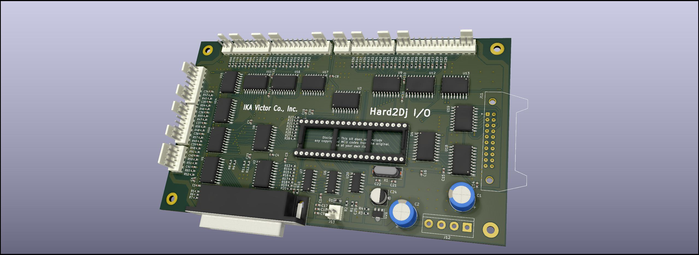

# AmuseWorld Ez2Dj I/O Board
* Role: Buffers for key inputs/outlatches for darlington light control drivers, turntable signal decoder, coin handler
* Part number: -
* Used on: Ez2Dj, Ez2Dj mini, EZ2AC
* Manufacturer: ?

## Original PCB

## Replacement

