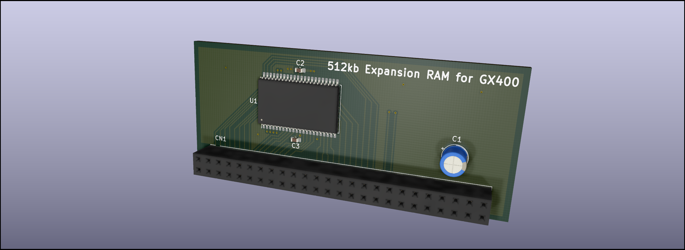
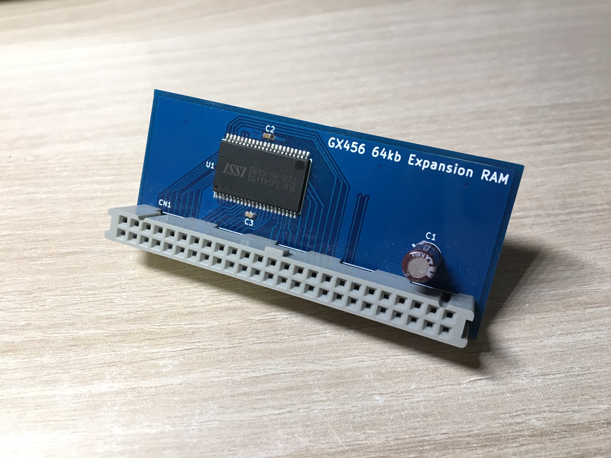

# Konami GX400 Expansion RAM
* Role: 512kbit expansion RAM board for running Gradius
* Purpose: Can be used instead of rare original RAM board

* Original part number: GX456
* Used on: Konami Bubble System and its revised upper board w/ROMs
* Manufacturer: Konami

This is a GX456 compatible expansion RAM board which can be used for running Gradius.

# Parts list
U1: IS61C6416 1Mb SRAM

C1: Any vendor 47uF 25V electrolytic capacitor

C2: C1608Y5V104Z25V 0.1uF 25V 1608 MLCC

C3: C1608Y5V104Z25V 0.1uF 25V 1608 MLCC

CN1: 3M 8550-4500PL
