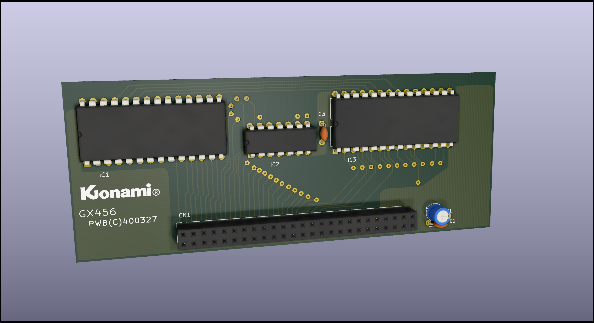

# Konami GX456
* Role: 128kbit expansion RAM board for running Gradius
* Part number: GX456
* Used on: Konami Bubble System and its revised upper board w/ROMs
* Manufacturer: Konami

# Parts list
IC1: 6264 64kbit SRAM

IC2: 74LS32 Quad 2-input OR gate

IC3: 6264 64kbit SRAM

C1: Any vendor 47uF 25V electrolytic capacitor

C2: NC

C3: Any vendor 0.1uF 25V ceramic capacitor

CN1: 3M 8550-4500PL
