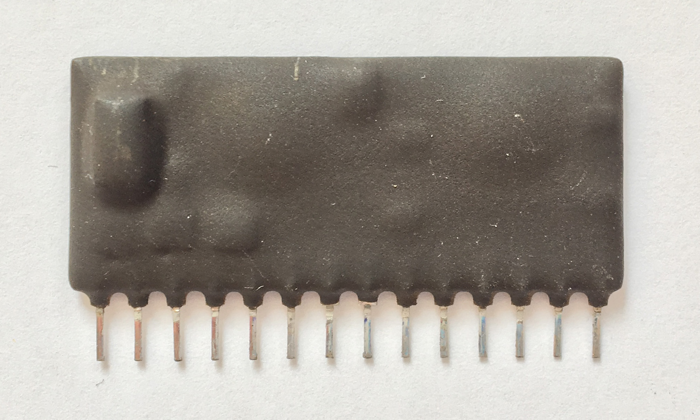
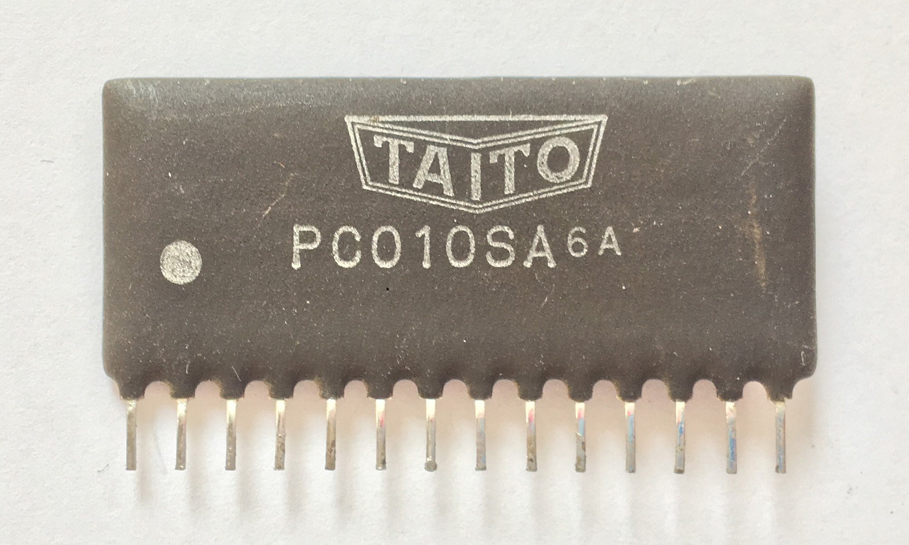
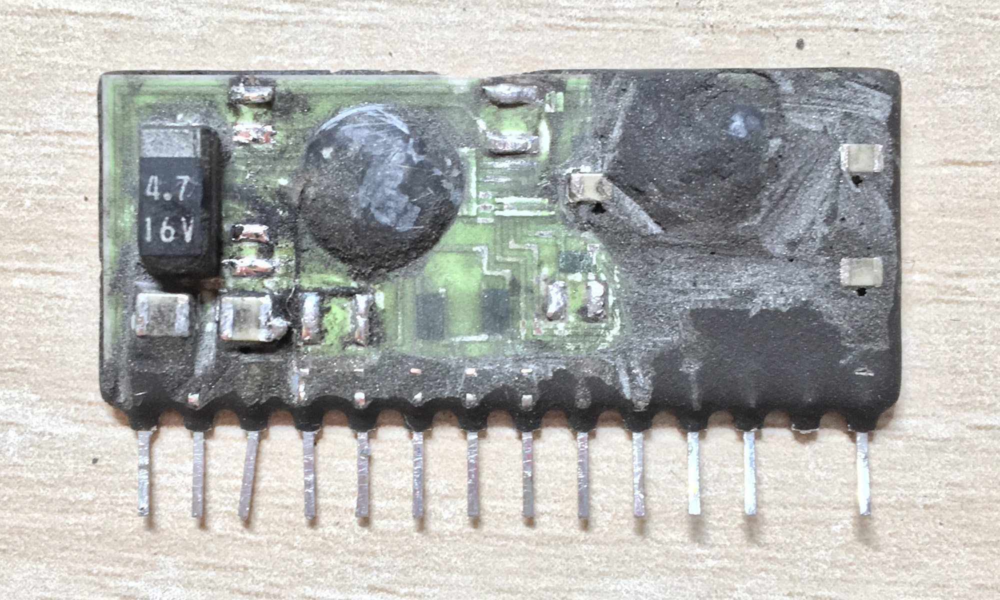
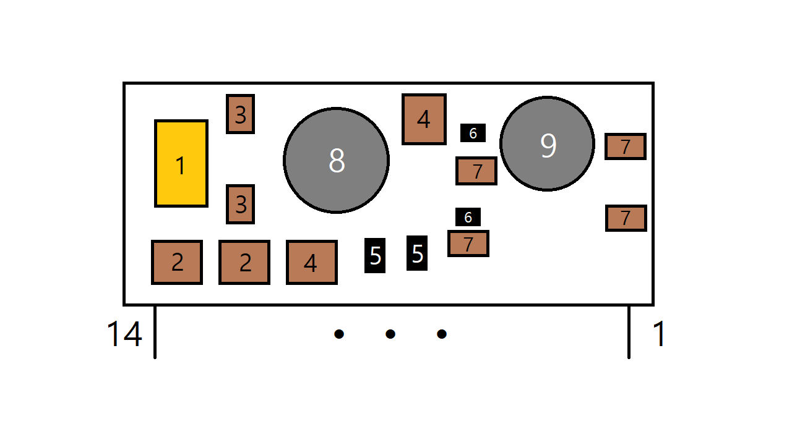

# Taito PC010SA
* Role: DC operated dual volume/tone/balance control IC
* Part number: PC010SA
* Used on: N.Y. Captor, The Legend of Kage(影の伝説), L.S.A. Squad(陸海空 最前線), Tokio(Scramble Formation), Darius, Big Event Golf
* Manufacturer: ?

Decapped by me(photo attached) There are two epoxy filled bare dies on its subtrate. I inferred chips' models and circuits from Taito's previous game, Buggy Challenge. 

## Original IC

## What's inside

### Components
1. 4.7u 16V tantalum capacitor
2. 100n MLCC (actual value 107nF)
3. 3.9n MLCC (actual value 4nF)
4. 100n MLCC (actual value 107nF)
5. 10k printed resistor
6. 1M printed resistor
7. 4.7n MLCC (actual value 5nF)
8. TA7630 silicon die
9. LM3900 silicon die (not verified, inferred from previous games)

### Pinout
1. Balance
2. Volume
3. LM_bias
4. Treble
5. Bass
6. +12V
7. Out B
8. TA_bias
9. Out A
10. Vref
11. GND
12. In A
13. In B
14. GND

## Replacement

### Parts list
