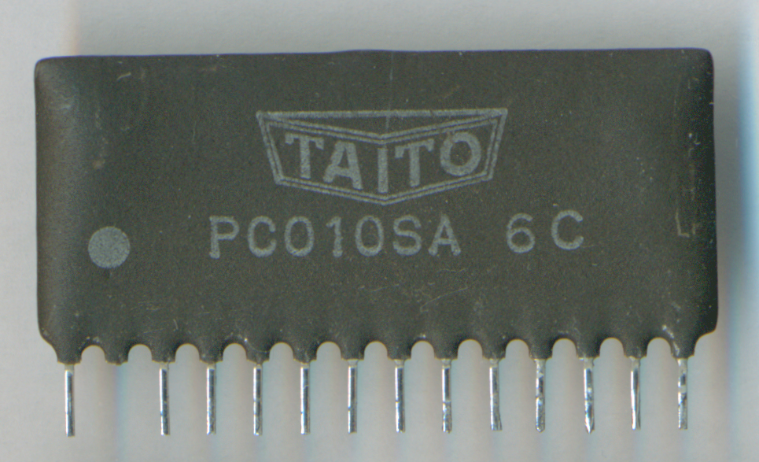

# Taito PC010SA
* Role: dual volume/balance/tone DC control chip
* Part number: PC010SA
* Used on: N.Y. Captor, The Legend of Kage(影の伝説), L.S.A. Squad(陸海空 最前線), Tokio(Scramble Formation), Darius, Big Event Golf
* Manufacturer: ?

Decapped by me(photo attached) There are two epoxy filled bare dies on its subtrate. I inferred chips' models and circuits from Taito's previous game, Buggy Challenge. 

