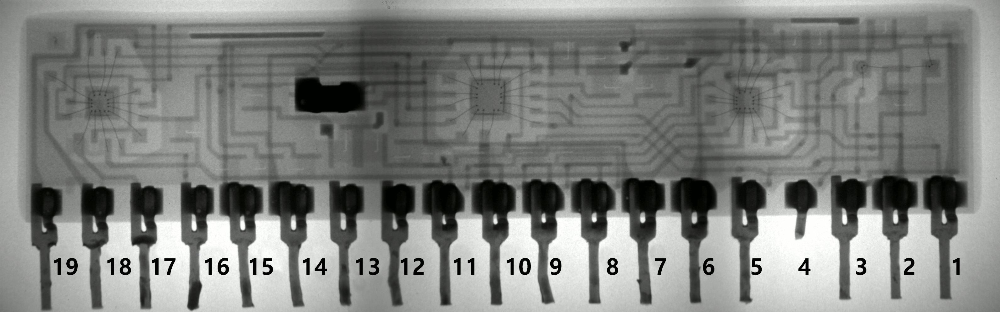

# Taito PC040DA
* Role: 6bit DAC with clock input and 3 blanking pins
* Part number: PC040DA
* Used on: The Legend of Kage(影の伝説), L.S.A. Squad(陸海空 最前線), Tokio(Scramble Formation), Bubble Bobble, Rainbow Islands, Darius, Rastan, Operation Wolf
* Manufacturer: ?

## Original IC

## What's inside

## Replacement

### Parts list
