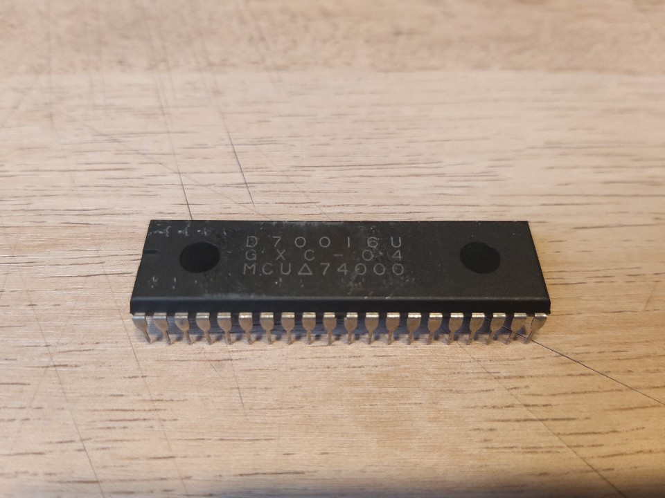

# Toaplan GXC-0x
* Role: Sound co-processor DSP
* Part number: GXC-01, GXC-02, GXC-03, GXC-04
* Used on: Hishou Zame(飛翔鮫), Flying Shark, Sky Shark, Wardner No Mori (ワードナの森), Kyukyoku Tiger(究極タイガー), Twin Cobra
* Manufacturer: Texas Instruments

This module can replace a faulty original chip. Activiting microprocessor mode of TMS32010 allows the DSP to execute instructions from external ROM area so any TMS32010 can be used for a replacement. It is possible to switch between 4 ROM banks by a DIP switch.

## Original IC

