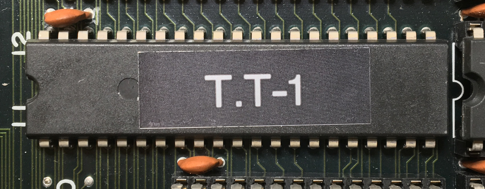

# Toaplan GXL-01
* Role: PISO shift register array
* Part number: GXL-01
* Used on: Hishou Zame(飛翔鮫), Flying Shark, Sky Shark, Wardner No Mori (ワードナの森), Kyukyoku Tiger(究極タイガー), Twin Cobra
* Manufacturer: ?

## Original IC

### Pinout
1: CLK

2: MODE1

3: MODE0

4, 5, 6, 7, 8, 9, 10, 11: REG0_IN

12, 13, 14, 15, 16, 17, 18, 19: REG1_IN

20, 22, 23, 24, 25, 26, 27, 28: REG2_IN

29, 30, 31, 32, 33, 34, 35, 36: REG3_IN

37: REG0_OUT

38: REG1_OUT

39: REG2_OUT

40: REG3_OUT

41: SEL(MSB=1, LSB=0)

21: GND

42: Vcc

## Replacement

### Parts list